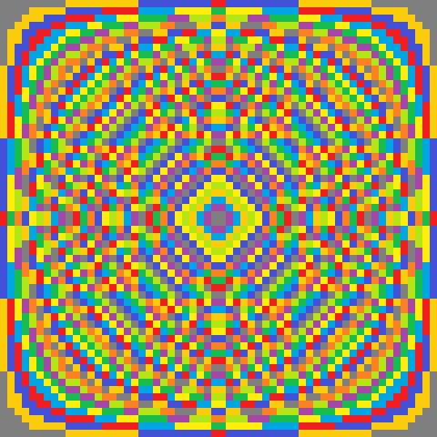

```{r setup, include=FALSE}
knitr::opts_chunk$set(echo = TRUE, fig.height = 4, fig.width = 4)
set.seed(2)
```


## Contents

- About this doc
- Initial functions and variables
- Changing the number of columns
- Changing colours
- Changing colour functions
- Saving images
- Saving GIFs


## About this doc

## Initial functions and variables

Below is the original code and plotting function from back in August.

```{r}

# A helper function, and Mum's colour scheme -----------------------------------

# This function extracts the digit in a number's 'tens column'. E.g. 4 returns
# 0, 60 returns 6.
tens_col <- function(x) {
  x <- formatC(x, width = 2, flag = "0")
  substr(x, nchar(x) - 1, nchar(x) - 1)
}

# Colours taken from the Facebook post
mum_cols <- c("#7F7F7F", "#FBCC0C", "#4351D6", "#F01E21", "#00A5E5", "#FFEE0B",
              "#17BD4F", "#A646A7", "#B4E615", "#FC8123")


# A function to manipulate matricies, and plot results -------------------------

# The plotting function. This accepts the 'to' and 'from' numbers for the times
# tables, a function to apply to the numbers, and a vector of colours to
# represent the numbers generated by 'fun'
#' Title
#'
#' @param n1 The starting number for the grid. The default is 1.
#' @param n2 The final number for the grid. If n1 = 1, then n2 is also the
#'   number of columns that the plot will have. The default is 35.
#' @param fun The function used to
#' @param colours
#'
plot_matrix <- function(n1 = 1, n2 = 35, fun = tens_col, colours = mum_cols) {
  a <- matrix(rep(c(n1:n2, n2:n1), each = (abs(n2 - n1) + 1) * 2),
              ncol = (abs(n2 - n1) + 1) * 2)
  
  m <- fun(a * t(a))
  class(m) <- "numeric"
  par(mar = rep(0, 4))
  image(m, col = colours, xaxt = "n", yaxt = "n")
}

```


## Changing the number of columns

The code for `plot_matrix` above is stored in what's called a 'function'. This
means that we just need to type `plot_matrix(...)`, and all the code between
the curly braces will run again.

However, we can also vary what we put between the round brackets --- known as
the *fuction parameters* --- the inputs to the code that generates the images.
The function has default parameters, but we can also vary them to generate new
images. Some examples follow.

Note: For these lines of code to run, all of the code above must be stored in
R's memory. This just means copy and pasting them into the console.


```{r}

# We can generate the original 35 square image just using the default parameters
plot_matrix()

# We can change the parameter `n2`, to see different numbers of colums. Let's take a look at just 5.
plot_matrix(n2 = 5)

# And 100
plot_matrix(n2 = 200)

```


The pattern is repeating, it's a fractal!

Note: the higher the number that you enter, the more data is generated and
stored in your computer's RAM. The amount of RAM that you have is the limit on
the size of the number that you can enter, but it all looks the same after
about 300 anyway.

The code to generate the GIF (at the bottom of this file), simply iterated
through different numbers for n2 each time, adding 1 to the previous amount,
making the plot, saving the image, and then repeating. All of the images were
combined into a GIF.


## Changing colours

R understands colours in two main ways: As RGB values (like "#FC8123" for
orange in your original image --- you can find RGB values from the colour
picker in MS Paint), and also as words like "blue". Of course, R can't turn
every word into a colour, but we can see the words that R understands as
colours, buy typing `colours()`.


```{r}

colours()

```

As our tens column can contain 0 - 9, we need 10 colours. Let's pick 10 from
that list, and put them into a new list (technically a 'vector') with a name.

```{r}

new_colours <- c("white", "aliceblue", "antiquewhite", "antiquewhite1",
                 "antiquewhite2", "antiquewhite3", "antiquewhite4",
                 "aquamarine", "aquamarine1", "aquamarine2")

# If we type `new_colours`, R will output the contents of the list we made

new_colours


```


We can now supply this to the `colours` parameter of `plot_matrix`, and make a
new plot

```{r}

plot_matrix(n2 = 35, colours = new_colours)

```

Strange and minty! Below I've written a little function which will output 10
random entries from `colours()` each time it's called. By supplying this to
the colours parameter, we can see random colours each time!

```{r}

random_colours <- function(n = 10) {
  colours()[sample(1:length(colours()), size = 10)]
}

# We can run the line of code below over and over again, and see different
# colours each time!

plot_matrix(n2 = 35, colours = random_colours())
plot_matrix(n2 = 35, colours = random_colours())
plot_matrix(n2 = 35, colours = random_colours())
plot_matrix(n2 = 35, colours = random_colours())
plot_matrix(n2 = 35, colours = random_colours())

```

## Changing colour *functions*

All of the above uses the same method to choose which colour should go in
which square, which is the rule you used for the original picture --- the value
in the number's tens column.

However, we could write a new function and make that the 'ones column'...

```{r}

ones_col <- function(x) {
  x <- formatC(x, width = 1, flag = "0")
  substr(x, nchar(x), nchar(x))
}

plot_matrix(n2 = 22, fun = ones_col)

```

Or the hundreds column...

```{r}

hundreds_col <- function(x) {
  x <- formatC(x, width = 3, flag = "0")
  substr(x, nchar(x) - 3, nchar(x) - 3)
}

plot_matrix(n2 = 100, fun = hundreds_col)

```

```{r}

# This looks great!
tens_col_square <- function(x) {
  tens_col(x^2)
}

plot_matrix(n2 = 30, fun = tens_col_square)

```

## Saving images

If we like, we can save the image. You need to specify where to save it using
text known as a 'file path' (like a URL for your computer). A file path also
includes a file-name, and a file-extension. We'll save images as png files, as
they work well for this type of picture.

On your machine, this is probably something like
`C:\\Users\\Mum\\Documents\\my_image.png`. On mine, I'll just save them to
the current 'working directory' (the folder R is currently working in). We can
ask R which folder it's currently working in with `getwd()` (or, get working
directory).

```{r}
# Which folder am I in?
getwd()
```

```{r}
# Sounds good to me. Save the currentl plot as a PNG image there, with the
# following filename. We can also specify the width and height of the image
# (units are in pixels)
dev.print(png, filename = "image1.png", width = 480, height = 480)
```


## Saving GIFs

Below is the code used to produce that GIF back in August. It uses a 'loop'; for
the numbers between 3 and 150, it produces a plot, and saves the image. It then
combined up all the images and saves the into a GIF. It's not very easy to tell
all that from looking at the code, but it's possible to make animations by
changing the parameters of the function at each frame.

```{r gifs, eval = FALSE}
library(animation)
n_frames <- 150

animation::saveGIF({
  for (i in 3:n_frames) {
    plot_matrix(1, i)
  }
}, movie.name = "mothers_matrix_masterpiece.gif", interval = 0.25
)

```


Here's another GIF, this time with the number of columns staying the same, but with the numbers raised to a power, gradually changing from the power of 1 to the power of 2 each time.

For example, at the very first frame, the colours are decided by taking the tens column of the result of the multiplication, to the power of one, rounded (e.g. it's the same as your original image). On the very last frame, it's the tens col of the multiplication, to the power of two, rounded. A growing ball of grey (zeroes) appears in the middle.

```{r, eval = FALSE}
n_frames <- 100
power_seq <- seq(from = 1, to = 2, length = n_frames)


animation::saveGIF({
  for (i in 1:n_frames) {
    # This looks great!
    colour_function <- function(x) {
      tens_col(round(x^power_seq[i]))
    }
    
    plot_matrix(n2 = 30, fun = colour_function)
  }
}, movie.name = "power_of_one_into_two.gif", interval = 0.25
) 
```




I also noticed an interesting pattern by way of a bug in my original programming --- without adding rounding, the decimal point is included in the tens col function, and then the rest of the code tries to convert `.` to a number, resulting in `NA`, which the plotting function represents as white.

This bug makes quite a nice pattern!

```{r, eval = FALSE}
n_frames <- 100
power_seq <- seq(from = 1, to = 2, length = n_frames)


animation::saveGIF({
  for (i in 1:n_frames) {
    # This looks great!
    colour_function <- function(x) {
      tens_col(x^power_seq[i])
    }
    
    plot_matrix(n2 = 30, fun = colour_function)
  }
}, movie.name = "power_of_one_to_two_with_a_white_decimal.gif", interval = 0.25
) 
```


