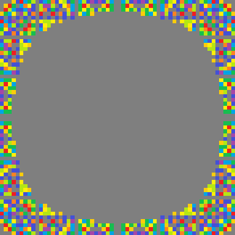
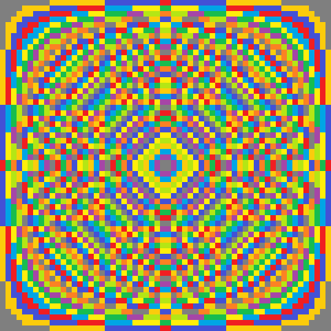

Contents
--------

-   About this doc
-   Initial functions and variables
-   Changing the number of columns
-   Changing colours
-   Changing colour functions
-   Saving images
-   Saving GIFs

About this doc
--------------

Initial functions and variables
-------------------------------

Below is the original code and plotting function from back in August.

    # A helper function, and Mum's colour scheme -----------------------------------

    # This function extracts the digit in a number's 'tens column'. E.g. 4 returns
    # 0, 60 returns 6.
    tens_col <- function(x) {
      x <- formatC(x, width = 2, flag = "0")
      substr(x, nchar(x) - 1, nchar(x) - 1)
    }

    # Colours taken from the Facebook post
    mum_cols <- c("#7F7F7F", "#FBCC0C", "#4351D6", "#F01E21", "#00A5E5", "#FFEE0B",
                  "#17BD4F", "#A646A7", "#B4E615", "#FC8123")

    # A function to manipulate matricies, and plot results -------------------------

    # The plotting function. This accepts the 'to' and 'from' numbers for the times
    # tables, a function to apply to the numbers, and a vector of colours to
    # represent the numbers generated by 'fun'
    #' Title
    #'
    #' @param n1 The starting number for the grid. The default is 1.
    #' @param n2 The final number for the grid. If n1 = 1, then n2 is also the
    #'   number of columns that the plot will have. The default is 35.
    #' @param fun The function used to
    #' @param colours
    #'
    plot_matrix <- function(n1 = 1, n2 = 35, fun = tens_col, colours = mum_cols) {
      a <- matrix(rep(c(n1:n2, n2:n1), each = n2 * 2), ncol = n2 * 2)
      m <- fun(a * t(a))
      class(m) <- "numeric"
      par(mar = rep(0, 4))
      image(m, col = colours, xaxt = "n", yaxt = "n")
    }

Changing the number of columns
------------------------------

The code for `plot_matrix` above is stored in what's called a
'function'. This means that we just need to type `plot_matrix(...)`, and
all the code between the curly braces will run again.

However, we can also vary what we put between the round brackets ---
known as the *fuction parameters* --- the inputs to the code that
generates the images. The function has default parameters, but we can
also vary them to generate new images. Some examples follow.

Note: For these lines of code to run, all of the code above must be
stored in R's memory. This just means copy and pasting them into the
console.

    # We can generate the original 35 square image just using the default parameters
    plot_matrix()

    # We can change the parameter `n2`, to see different numbers of colums. Let's take a look at just 5.
    plot_matrix(n2 = 5)

    # And 100
    plot_matrix(n2 = 200)

The pattern is repeating, it's a fractal!

Note: the higher the number that you enter, the more data is generated
and stored in your computer's RAM. The amount of RAM that you have is
the limit on the size of the number that you can enter, but it all looks
the same after about 300 anyway.

The code to generate the GIF (at the bottom of this file), simply
iterated through different numbers for n2 each time, adding 1 to the
previous amount, making the plot, saving the image, and then repeating.
All of the images were combined into a GIF.

Changing colours
----------------

R understands colours in two main ways: As RGB values (like "\#FC8123"
for orange in your original image --- you can find RGB values from the
colour picker in MS Paint), and also as words like "blue". Of course, R
can't turn every word into a colour, but we can see the words that R
understands as colours, buy typing `colours()`.

    colours()

    ##   [1] "white"                "aliceblue"            "antiquewhite"        
    ##   [4] "antiquewhite1"        "antiquewhite2"        "antiquewhite3"       
    ##   [7] "antiquewhite4"        "aquamarine"           "aquamarine1"         
    ##  [10] "aquamarine2"          "aquamarine3"          "aquamarine4"         
    ##  [13] "azure"                "azure1"               "azure2"              
    ##  [16] "azure3"               "azure4"               "beige"               
    ##  [19] "bisque"               "bisque1"              "bisque2"             
    ##  [22] "bisque3"              "bisque4"              "black"               
    ##  [25] "blanchedalmond"       "blue"                 "blue1"               
    ##  [28] "blue2"                "blue3"                "blue4"               
    ##  [31] "blueviolet"           "brown"                "brown1"              
    ##  [34] "brown2"               "brown3"               "brown4"              
    ##  [37] "burlywood"            "burlywood1"           "burlywood2"          
    ##  [40] "burlywood3"           "burlywood4"           "cadetblue"           
    ##  [43] "cadetblue1"           "cadetblue2"           "cadetblue3"          
    ##  [46] "cadetblue4"           "chartreuse"           "chartreuse1"         
    ##  [49] "chartreuse2"          "chartreuse3"          "chartreuse4"         
    ##  [52] "chocolate"            "chocolate1"           "chocolate2"          
    ##  [55] "chocolate3"           "chocolate4"           "coral"               
    ##  [58] "coral1"               "coral2"               "coral3"              
    ##  [61] "coral4"               "cornflowerblue"       "cornsilk"            
    ##  [64] "cornsilk1"            "cornsilk2"            "cornsilk3"           
    ##  [67] "cornsilk4"            "cyan"                 "cyan1"               
    ##  [70] "cyan2"                "cyan3"                "cyan4"               
    ##  [73] "darkblue"             "darkcyan"             "darkgoldenrod"       
    ##  [76] "darkgoldenrod1"       "darkgoldenrod2"       "darkgoldenrod3"      
    ##  [79] "darkgoldenrod4"       "darkgray"             "darkgreen"           
    ##  [82] "darkgrey"             "darkkhaki"            "darkmagenta"         
    ##  [85] "darkolivegreen"       "darkolivegreen1"      "darkolivegreen2"     
    ##  [88] "darkolivegreen3"      "darkolivegreen4"      "darkorange"          
    ##  [91] "darkorange1"          "darkorange2"          "darkorange3"         
    ##  [94] "darkorange4"          "darkorchid"           "darkorchid1"         
    ##  [97] "darkorchid2"          "darkorchid3"          "darkorchid4"         
    ## [100] "darkred"              "darksalmon"           "darkseagreen"        
    ## [103] "darkseagreen1"        "darkseagreen2"        "darkseagreen3"       
    ## [106] "darkseagreen4"        "darkslateblue"        "darkslategray"       
    ## [109] "darkslategray1"       "darkslategray2"       "darkslategray3"      
    ## [112] "darkslategray4"       "darkslategrey"        "darkturquoise"       
    ## [115] "darkviolet"           "deeppink"             "deeppink1"           
    ## [118] "deeppink2"            "deeppink3"            "deeppink4"           
    ## [121] "deepskyblue"          "deepskyblue1"         "deepskyblue2"        
    ## [124] "deepskyblue3"         "deepskyblue4"         "dimgray"             
    ## [127] "dimgrey"              "dodgerblue"           "dodgerblue1"         
    ## [130] "dodgerblue2"          "dodgerblue3"          "dodgerblue4"         
    ## [133] "firebrick"            "firebrick1"           "firebrick2"          
    ## [136] "firebrick3"           "firebrick4"           "floralwhite"         
    ## [139] "forestgreen"          "gainsboro"            "ghostwhite"          
    ## [142] "gold"                 "gold1"                "gold2"               
    ## [145] "gold3"                "gold4"                "goldenrod"           
    ## [148] "goldenrod1"           "goldenrod2"           "goldenrod3"          
    ## [151] "goldenrod4"           "gray"                 "gray0"               
    ## [154] "gray1"                "gray2"                "gray3"               
    ## [157] "gray4"                "gray5"                "gray6"               
    ## [160] "gray7"                "gray8"                "gray9"               
    ## [163] "gray10"               "gray11"               "gray12"              
    ## [166] "gray13"               "gray14"               "gray15"              
    ## [169] "gray16"               "gray17"               "gray18"              
    ## [172] "gray19"               "gray20"               "gray21"              
    ## [175] "gray22"               "gray23"               "gray24"              
    ## [178] "gray25"               "gray26"               "gray27"              
    ## [181] "gray28"               "gray29"               "gray30"              
    ## [184] "gray31"               "gray32"               "gray33"              
    ## [187] "gray34"               "gray35"               "gray36"              
    ## [190] "gray37"               "gray38"               "gray39"              
    ## [193] "gray40"               "gray41"               "gray42"              
    ## [196] "gray43"               "gray44"               "gray45"              
    ## [199] "gray46"               "gray47"               "gray48"              
    ## [202] "gray49"               "gray50"               "gray51"              
    ## [205] "gray52"               "gray53"               "gray54"              
    ## [208] "gray55"               "gray56"               "gray57"              
    ## [211] "gray58"               "gray59"               "gray60"              
    ## [214] "gray61"               "gray62"               "gray63"              
    ## [217] "gray64"               "gray65"               "gray66"              
    ## [220] "gray67"               "gray68"               "gray69"              
    ## [223] "gray70"               "gray71"               "gray72"              
    ## [226] "gray73"               "gray74"               "gray75"              
    ## [229] "gray76"               "gray77"               "gray78"              
    ## [232] "gray79"               "gray80"               "gray81"              
    ## [235] "gray82"               "gray83"               "gray84"              
    ## [238] "gray85"               "gray86"               "gray87"              
    ## [241] "gray88"               "gray89"               "gray90"              
    ## [244] "gray91"               "gray92"               "gray93"              
    ## [247] "gray94"               "gray95"               "gray96"              
    ## [250] "gray97"               "gray98"               "gray99"              
    ## [253] "gray100"              "green"                "green1"              
    ## [256] "green2"               "green3"               "green4"              
    ## [259] "greenyellow"          "grey"                 "grey0"               
    ## [262] "grey1"                "grey2"                "grey3"               
    ## [265] "grey4"                "grey5"                "grey6"               
    ## [268] "grey7"                "grey8"                "grey9"               
    ## [271] "grey10"               "grey11"               "grey12"              
    ## [274] "grey13"               "grey14"               "grey15"              
    ## [277] "grey16"               "grey17"               "grey18"              
    ## [280] "grey19"               "grey20"               "grey21"              
    ## [283] "grey22"               "grey23"               "grey24"              
    ## [286] "grey25"               "grey26"               "grey27"              
    ## [289] "grey28"               "grey29"               "grey30"              
    ## [292] "grey31"               "grey32"               "grey33"              
    ## [295] "grey34"               "grey35"               "grey36"              
    ## [298] "grey37"               "grey38"               "grey39"              
    ## [301] "grey40"               "grey41"               "grey42"              
    ## [304] "grey43"               "grey44"               "grey45"              
    ## [307] "grey46"               "grey47"               "grey48"              
    ## [310] "grey49"               "grey50"               "grey51"              
    ## [313] "grey52"               "grey53"               "grey54"              
    ## [316] "grey55"               "grey56"               "grey57"              
    ## [319] "grey58"               "grey59"               "grey60"              
    ## [322] "grey61"               "grey62"               "grey63"              
    ## [325] "grey64"               "grey65"               "grey66"              
    ## [328] "grey67"               "grey68"               "grey69"              
    ## [331] "grey70"               "grey71"               "grey72"              
    ## [334] "grey73"               "grey74"               "grey75"              
    ## [337] "grey76"               "grey77"               "grey78"              
    ## [340] "grey79"               "grey80"               "grey81"              
    ## [343] "grey82"               "grey83"               "grey84"              
    ## [346] "grey85"               "grey86"               "grey87"              
    ## [349] "grey88"               "grey89"               "grey90"              
    ## [352] "grey91"               "grey92"               "grey93"              
    ## [355] "grey94"               "grey95"               "grey96"              
    ## [358] "grey97"               "grey98"               "grey99"              
    ## [361] "grey100"              "honeydew"             "honeydew1"           
    ## [364] "honeydew2"            "honeydew3"            "honeydew4"           
    ## [367] "hotpink"              "hotpink1"             "hotpink2"            
    ## [370] "hotpink3"             "hotpink4"             "indianred"           
    ## [373] "indianred1"           "indianred2"           "indianred3"          
    ## [376] "indianred4"           "ivory"                "ivory1"              
    ## [379] "ivory2"               "ivory3"               "ivory4"              
    ## [382] "khaki"                "khaki1"               "khaki2"              
    ## [385] "khaki3"               "khaki4"               "lavender"            
    ## [388] "lavenderblush"        "lavenderblush1"       "lavenderblush2"      
    ## [391] "lavenderblush3"       "lavenderblush4"       "lawngreen"           
    ## [394] "lemonchiffon"         "lemonchiffon1"        "lemonchiffon2"       
    ## [397] "lemonchiffon3"        "lemonchiffon4"        "lightblue"           
    ## [400] "lightblue1"           "lightblue2"           "lightblue3"          
    ## [403] "lightblue4"           "lightcoral"           "lightcyan"           
    ## [406] "lightcyan1"           "lightcyan2"           "lightcyan3"          
    ## [409] "lightcyan4"           "lightgoldenrod"       "lightgoldenrod1"     
    ## [412] "lightgoldenrod2"      "lightgoldenrod3"      "lightgoldenrod4"     
    ## [415] "lightgoldenrodyellow" "lightgray"            "lightgreen"          
    ## [418] "lightgrey"            "lightpink"            "lightpink1"          
    ## [421] "lightpink2"           "lightpink3"           "lightpink4"          
    ## [424] "lightsalmon"          "lightsalmon1"         "lightsalmon2"        
    ## [427] "lightsalmon3"         "lightsalmon4"         "lightseagreen"       
    ## [430] "lightskyblue"         "lightskyblue1"        "lightskyblue2"       
    ## [433] "lightskyblue3"        "lightskyblue4"        "lightslateblue"      
    ## [436] "lightslategray"       "lightslategrey"       "lightsteelblue"      
    ## [439] "lightsteelblue1"      "lightsteelblue2"      "lightsteelblue3"     
    ## [442] "lightsteelblue4"      "lightyellow"          "lightyellow1"        
    ## [445] "lightyellow2"         "lightyellow3"         "lightyellow4"        
    ## [448] "limegreen"            "linen"                "magenta"             
    ## [451] "magenta1"             "magenta2"             "magenta3"            
    ## [454] "magenta4"             "maroon"               "maroon1"             
    ## [457] "maroon2"              "maroon3"              "maroon4"             
    ## [460] "mediumaquamarine"     "mediumblue"           "mediumorchid"        
    ## [463] "mediumorchid1"        "mediumorchid2"        "mediumorchid3"       
    ## [466] "mediumorchid4"        "mediumpurple"         "mediumpurple1"       
    ## [469] "mediumpurple2"        "mediumpurple3"        "mediumpurple4"       
    ## [472] "mediumseagreen"       "mediumslateblue"      "mediumspringgreen"   
    ## [475] "mediumturquoise"      "mediumvioletred"      "midnightblue"        
    ## [478] "mintcream"            "mistyrose"            "mistyrose1"          
    ## [481] "mistyrose2"           "mistyrose3"           "mistyrose4"          
    ## [484] "moccasin"             "navajowhite"          "navajowhite1"        
    ## [487] "navajowhite2"         "navajowhite3"         "navajowhite4"        
    ## [490] "navy"                 "navyblue"             "oldlace"             
    ## [493] "olivedrab"            "olivedrab1"           "olivedrab2"          
    ## [496] "olivedrab3"           "olivedrab4"           "orange"              
    ## [499] "orange1"              "orange2"              "orange3"             
    ## [502] "orange4"              "orangered"            "orangered1"          
    ## [505] "orangered2"           "orangered3"           "orangered4"          
    ## [508] "orchid"               "orchid1"              "orchid2"             
    ## [511] "orchid3"              "orchid4"              "palegoldenrod"       
    ## [514] "palegreen"            "palegreen1"           "palegreen2"          
    ## [517] "palegreen3"           "palegreen4"           "paleturquoise"       
    ## [520] "paleturquoise1"       "paleturquoise2"       "paleturquoise3"      
    ## [523] "paleturquoise4"       "palevioletred"        "palevioletred1"      
    ## [526] "palevioletred2"       "palevioletred3"       "palevioletred4"      
    ## [529] "papayawhip"           "peachpuff"            "peachpuff1"          
    ## [532] "peachpuff2"           "peachpuff3"           "peachpuff4"          
    ## [535] "peru"                 "pink"                 "pink1"               
    ## [538] "pink2"                "pink3"                "pink4"               
    ## [541] "plum"                 "plum1"                "plum2"               
    ## [544] "plum3"                "plum4"                "powderblue"          
    ## [547] "purple"               "purple1"              "purple2"             
    ## [550] "purple3"              "purple4"              "red"                 
    ## [553] "red1"                 "red2"                 "red3"                
    ## [556] "red4"                 "rosybrown"            "rosybrown1"          
    ## [559] "rosybrown2"           "rosybrown3"           "rosybrown4"          
    ## [562] "royalblue"            "royalblue1"           "royalblue2"          
    ## [565] "royalblue3"           "royalblue4"           "saddlebrown"         
    ## [568] "salmon"               "salmon1"              "salmon2"             
    ## [571] "salmon3"              "salmon4"              "sandybrown"          
    ## [574] "seagreen"             "seagreen1"            "seagreen2"           
    ## [577] "seagreen3"            "seagreen4"            "seashell"            
    ## [580] "seashell1"            "seashell2"            "seashell3"           
    ## [583] "seashell4"            "sienna"               "sienna1"             
    ## [586] "sienna2"              "sienna3"              "sienna4"             
    ## [589] "skyblue"              "skyblue1"             "skyblue2"            
    ## [592] "skyblue3"             "skyblue4"             "slateblue"           
    ## [595] "slateblue1"           "slateblue2"           "slateblue3"          
    ## [598] "slateblue4"           "slategray"            "slategray1"          
    ## [601] "slategray2"           "slategray3"           "slategray4"          
    ## [604] "slategrey"            "snow"                 "snow1"               
    ## [607] "snow2"                "snow3"                "snow4"               
    ## [610] "springgreen"          "springgreen1"         "springgreen2"        
    ## [613] "springgreen3"         "springgreen4"         "steelblue"           
    ## [616] "steelblue1"           "steelblue2"           "steelblue3"          
    ## [619] "steelblue4"           "tan"                  "tan1"                
    ## [622] "tan2"                 "tan3"                 "tan4"                
    ## [625] "thistle"              "thistle1"             "thistle2"            
    ## [628] "thistle3"             "thistle4"             "tomato"              
    ## [631] "tomato1"              "tomato2"              "tomato3"             
    ## [634] "tomato4"              "turquoise"            "turquoise1"          
    ## [637] "turquoise2"           "turquoise3"           "turquoise4"          
    ## [640] "violet"               "violetred"            "violetred1"          
    ## [643] "violetred2"           "violetred3"           "violetred4"          
    ## [646] "wheat"                "wheat1"               "wheat2"              
    ## [649] "wheat3"               "wheat4"               "whitesmoke"          
    ## [652] "yellow"               "yellow1"              "yellow2"             
    ## [655] "yellow3"              "yellow4"              "yellowgreen"

As our tens column can contain 0 - 9, we need 10 colours. Let's pick 10
from that list, and put them into a new list (technically a 'vector')
with a name.

    new_colours <- c("white", "aliceblue", "antiquewhite", "antiquewhite1",
                     "antiquewhite2", "antiquewhite3", "antiquewhite4",
                     "aquamarine", "aquamarine1", "aquamarine2")

    # If we type `new_colours`, R will output the contents of the list we made

    new_colours

    ##  [1] "white"         "aliceblue"     "antiquewhite"  "antiquewhite1"
    ##  [5] "antiquewhite2" "antiquewhite3" "antiquewhite4" "aquamarine"   
    ##  [9] "aquamarine1"   "aquamarine2"

We can now supply this to the `colours` parameter of `plot_matrix`, and
make a new plot

    plot_matrix(n2 = 35, colours = new_colours)

Strange and minty! Below I've written a little function which will
output 10 random entries from `colours()` each time it's called. By
supplying this to the colours parameter, we can see random colours each
time!

    random_colours <- function(n = 10) {
      colours()[sample(1:length(colours()), size = 10)]
    }

    # We can run the line of code below over and over again, and see different
    # colours each time!

    plot_matrix(n2 = 35, colours = random_colours())

    plot_matrix(n2 = 35, colours = random_colours())

    plot_matrix(n2 = 35, colours = random_colours())

    plot_matrix(n2 = 35, colours = random_colours())

    plot_matrix(n2 = 35, colours = random_colours())

Changing colour *functions*
---------------------------

All of the above uses the same method to choose which colour should go
in which square, which is the rule you used for the original picture ---
the value in the number's tens column.

However, we could write a new function and make that the 'ones
column'...

    ones_col <- function(x) {
      x <- formatC(x, width = 1, flag = "0")
      substr(x, nchar(x), nchar(x))
    }

    plot_matrix(n2 = 22, fun = ones_col)

Or the hundreds column...

    hundreds_col <- function(x) {
      x <- formatC(x, width = 3, flag = "0")
      substr(x, nchar(x) - 3, nchar(x) - 3)
    }

    plot_matrix(n2 = 100, fun = hundreds_col)

    # This looks great!
    tens_col_square <- function(x) {
      tens_col(x^2)
    }

    plot_matrix(n2 = 30, fun = tens_col_square)

Saving images
-------------

If we like, we can save the image. You need to specify where to save it
using text known as a 'file path' (like a URL for your computer). A file
path also includes a file-name, and a file-extension. We'll save images
as png files, as they work well for this type of picture.

On your machine, this is probably something like
`C:\\Users\\Mum\\Documents\\my_image.png`. On mine, I'll just save them
to the current 'working directory' (the folder R is currently working
in). We can ask R which folder it's currently working in with `getwd()`
(or, get working directory).

    # Which folder am I in?
    getwd()

    ## [1] "/home/br/projects/mum_art"

    # Sounds good to me. Save the currentl plot as a PNG image there, with the
    # following filename. We can also specify the width and height of the image
    # (units are in pixels)
    dev.print(png, filename = "image1.png", width = 480, height = 480)

    ## RStudioGD 
    ##         2

Saving GIFs
-----------

Below is the code used to produce that GIF back in August. It uses a
'loop'; for the numbers between 3 and 150, it produces a plot, and saves
the image. It then combined up all the images and saves the into a GIF.
It's not very easy to tell all that from looking at the code, but it's
possible to make animations by changing the parameters of the function
at each frame.

    library(animation)
    n_frames <- 150

    animation::saveGIF({
      for (i in 3:n_frames) {
        plot_matrix(1, i)
      }
    }, movie.name = "mothers_matrix_masterpiece.gif", interval = 0.25
    )

Here's another GIF, this time with the number of columns staying the
same, but with the numbers raised to a power, gradually changing from
the power of 1 to the power of 2 each time.

For example, at the very first frame, the colours are decided by taking
the tens column of the result of the multiplication, to the power of
one, rounded (e.g. it's the same as your original image). On the very
last frame, it's the tens col of the multiplication, to the power of
two, rounded. A growing ball of grey (zeroes) appears in the middle.

    n_frames <- 100
    power_seq <- seq(from = 1, to = 2, length = n_frames)

    animation::saveGIF({
      for (i in 1:n_frames) {
        # This looks great!
        colour_function <- function(x) {
          tens_col(round(x^power_seq[i]))
        }
        
        plot_matrix(n2 = 30, fun = colour_function)
      }
    }, movie.name = "power_of_one_into_two.gif", interval = 0.25
    ) 

I also noticed an interesting pattern by way of a bug in my original
programming --- without adding rounding, the decimal point is included
in the tens col function, and then the rest of the code tries to convert
`.` to a number, resulting in `NA`, which the plotting function
represents as white.

This bug makes quite a nice pattern!

    n_frames <- 100
    power_seq <- seq(from = 1, to = 2, length = n_frames)

    animation::saveGIF({
      for (i in 1:n_frames) {
        # This looks great!
        colour_function <- function(x) {
          tens_col(x^power_seq[i])
        }
        
        plot_matrix(n2 = 30, fun = colour_function)
      }
    }, movie.name = "power_of_one_to_two_with_a_white_decimal.gif", interval = 0.25
    ) 

